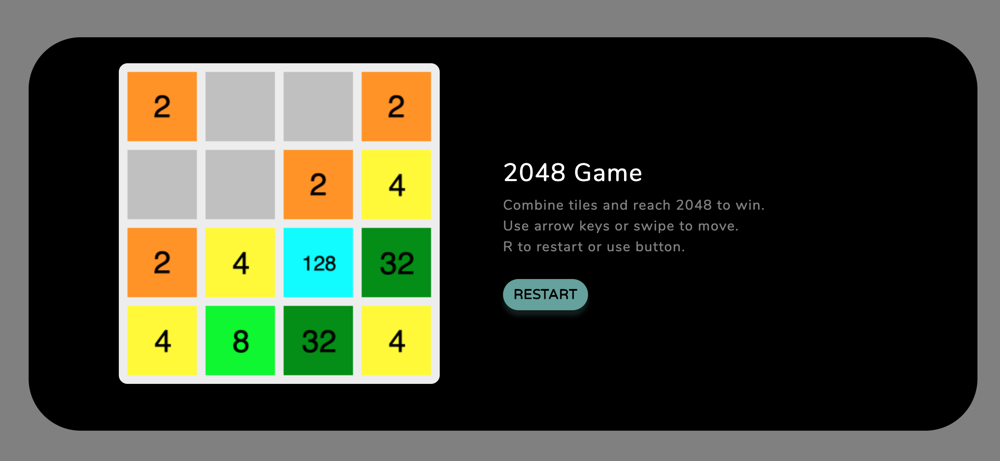

# My 2048 Game Clone

> Clones the popular [2048 game](https://play2048.co/).

## How To Play

Use your arrow keys (or swipe screen) to move the tiles. When two tiles with the same number touch, they merge into one!

## Motivation

I wanted to use JavaScript to make a game I could play on the browser so I could share it online with friends :) I decided that recreating a game would allow me to focus on the code and not get too distracted by trying to create a entirely new game. I knew this game would have various edge cases and be a challenge.

## Screenshot

## App Info

#### Author: [Jaime Lovera](https://github.com/jaimelovera)
